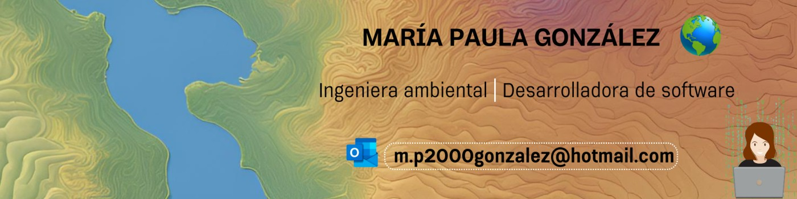

# Hola, mi nombre es María Paula González 👋

 

<!--
**mapu1/mapu1** is a ✨ _special_ ✨ repository because its `README.md` (this file) appears on your GitHub profile.
-->

## &nbsp;***Acerca de mí***

Soy ingeniera ambiental y estudiante de Análisis y Desarrollo de Software. Poseo habilidades en el manejo de sistemas de información geográfica, análisis espacial y bases de datos. Me encanta estudiar, aprender y construir cosas nuevas, innovadoras y creativas.

* **Tecnologías y programas**  
✔ SQL  
✔ MYSQL  
✔ POSTGIS  
✔ POSTGRES  
✔ UML  
✔ ARCGIS  
✔ QGIS

* **Me interesan los Sistemas de Información geográfica, la automatización de procesos y el desarrollo de software**
🌱 Actualmente estoy aprendiendo:  
  ✔ Análisis de Datos  
  ✔ PYTHON  
  ✔ Pregúntame cualquier cosa, ¡estaré feliz de ayudar, siempre y cuando me corresponda!😉 
  ✔ Fuera de la tecnología y medio ambiente, 📖 me encanta leer libros, 🎵 escuchar música y 🌴 explorar la naturaleza al aire libre.
📫 Contáctame en: <a href="mailto:m.p2000gonzalez@hotmail.com">m.p2000gonzalez@hotmail.com</a>
  
__Explora mi repositorio de GitHub:__

  

    <a href="https://github.com/mapu1/ubicacion_optima_sig">Visita mi repositorio</a>
  

  

    
  

---

Créditos: <a href="https://github.com/mapu1">mapu1</a>

Fecha: 18/11/2021

